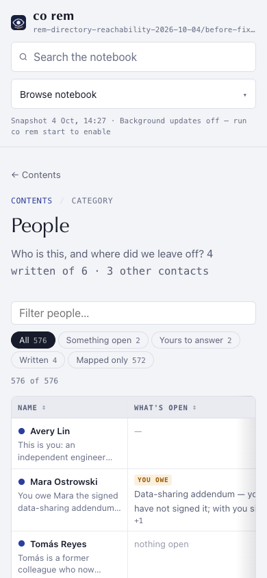
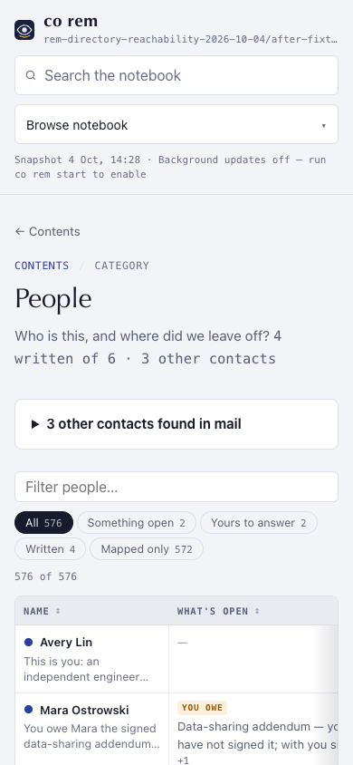

# Historical contacts must be reachable

## Finding

The 1.9.0a41 candidate's private two-mailbox map had 590 visible mapped
People rows and 803 other contacts. The People intro named the 803 contacts,
but their disclosure followed the entire mapped table. At 390×844 its top was
at y=1314, outside the first screen. The first fixture review had only a few
People rows and missed the scale effect. Private names and screenshots remain
local; the images here use invented fixture identities.

## Change and evidence

The collapsed other-contacts disclosure now precedes the mapped People roster.
The two groups keep their existing filters, search, source-coverage text and
actions. A real-data recheck moved its top from y=1314 to y=515 on a 390×844
phone and from y=1067 to y=249 at 1440×900, with zero horizontal overflow.
No private screenshot was committed.

An invented 576-person fixture produced these viewport measurements:

| State | Before disclosure y | After disclosure y | Horizontal overflow |
| --- | ---: | ---: | ---: |
| 390×844 light | 1297 | 441 | 0 px |
| 390×844 dark | 1297 | 441 | 0 px |
| 1440×900 light | 996 | 178 | 0 px |
| 1440×900 dark | 996 | 178 | 0 px |

 

The [browser test](../../../tests/e2e/cli/test_rem_reader_design_browser.py)
uses 570 added fixture People. It fails on the previous layout, then verifies
the disclosure appears in the first phone viewport, can be opened with Enter,
its contact search still works, and the mapped table's mobile header and
sorting remain usable. The full browser design suite should pass before merge.

## Experience review

This corrects a navigation dead end that a small mock could not reveal. It
does not turn the map into a finished memory: the real trial still had zero
written person pages because it was estimate-only. The Home source-map view
and the mapped-only roster still need the first-run insight and page-quality
work tracked in #2065 and #2206. Recheck those after an actual model run.
