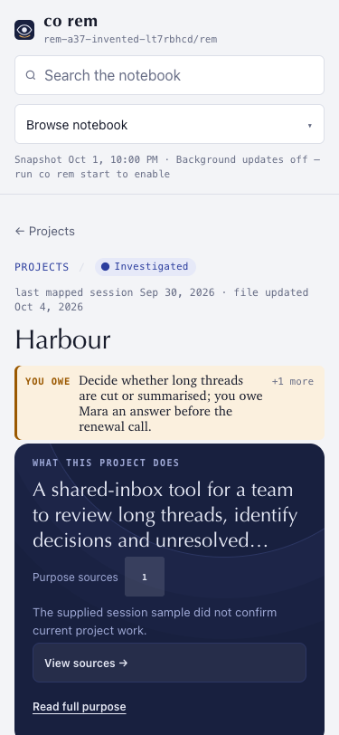
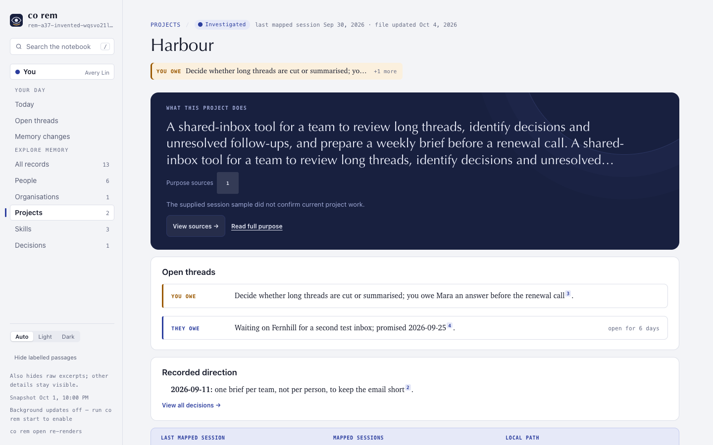

# Project purpose and source access (1.9.0a37)

These screenshots use an invented Project page with a long purpose and an open
thread. They show the initial, unexpanded reader at 375×812 and 1440×900.
The purpose source, **View sources**, and **Read full purpose** remain directly
reachable. The full wording is still available through the expansion control
and the always-visible Full memory section.

The screenshots demonstrate layout and navigation, not the accuracy of a real
Project purpose or its sources.
