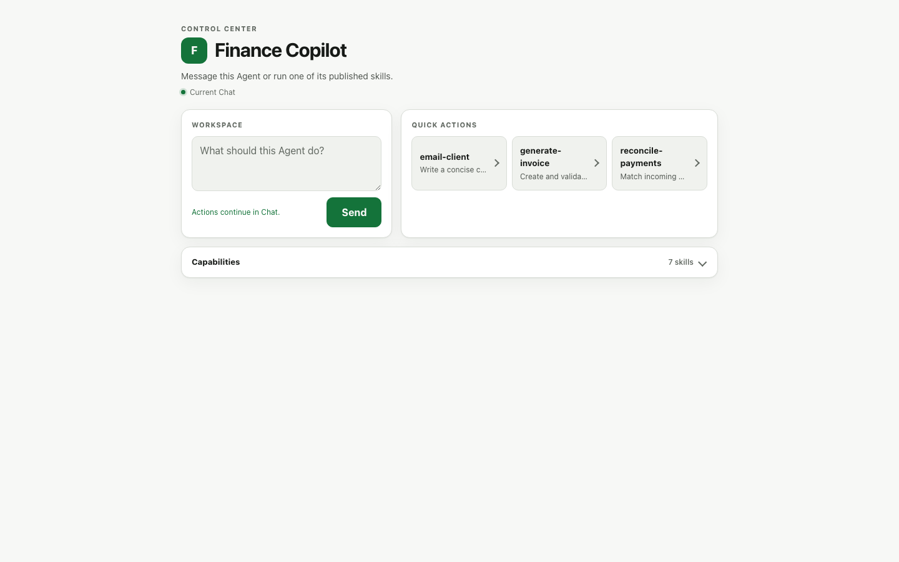
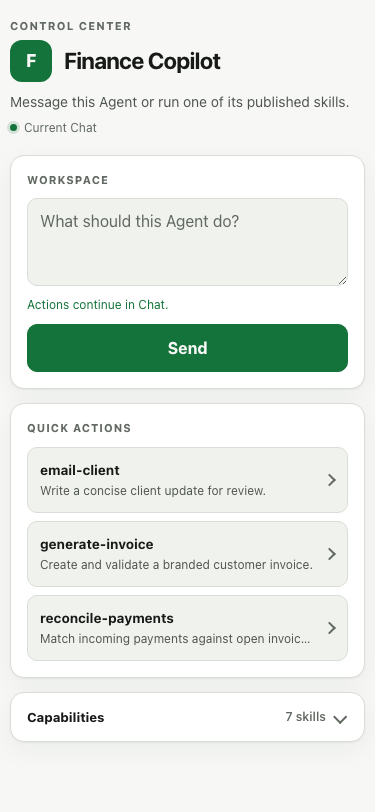

# Full Web Control Center

The full Web Control Center is an ordinary website embedded beside Chat. It replaces
the single-file, script-free snapshot with a real application: HTML, CSS, JavaScript,
routes, assets, and forms can all live together.

This feature is in preview. New projects get the editable source now; production
activation still requires the upload and independent-review service described below.

## Default template

`co create` and `co init` add this directory once:

```text
.co/control-center/
├── index.html
├── control-center.js
└── CONTROL_CENTER.md
```

The directory belongs to the project. A later `co init` never overwrites it. The
bundled template is the interactive full-Web version of CO AI's canonical default
Control Center in `network/host/ws_router/starter.html`: it keeps the same identity,
Workspace, Quick actions, Capabilities, color tokens, and responsive structure. It
adds ordinary-message and skill actions through the reviewed OChat bridge.

Preview the website while editing it:

```bash
python -m http.server 4173 --directory .co/control-center
```

The page can render outside OChat, but bridge actions need the OChat Host.

Desktop and 375px mobile references for the bundled template:





## What a button does

The bridge keeps actions inside the conversation instead of creating an invisible
background run:

- `send_message` appends a visible user message to the current Chat.
- `run_skill` appends the visible user message `/skill-name arguments`.
- On the landing screen, either action creates the first Chat.
- `conversation: "new"` creates a separate Chat only when the website asks for it.

The app receives a correlated acknowledgement through its `MessagePort`. The agent's
answer appears in Chat. Streaming normalized output back into the website can be added
later without changing these request actions.

The initial context includes the authenticated Agent identity, current session, and
skill names. The default template builds its buttons from that list, so it does not
need to hard-code invoice or other project-specific skills.

## The iframe URL

OChat uses exactly the authenticated `CONTROL_CENTER_APP.app.url` as the iframe
`src`. A test fixture may use a clearly fake value such as:

```text
https://control-center.e2e.test/invoices/
```

That is not a deployable link. The intended production form is an immutable,
content-addressed URL such as:

```text
https://apps.openonion.ai/<agent-address>/<sha256-revision>/index.html
```

The upload service must create that URL and an independent reviewer must approve the
same revision before the Host emits the descriptor. Those services are not part of the
current stable CLI, so the scaffold intentionally does not manufacture an "approved"
JSON file or pretend that a local URL is production-ready.

## Trust boundary

A full website needs JavaScript and network access, so it cannot inherit the legacy
snapshot's script-blocking sandbox. Safety comes from a different boundary:

1. Upload produces an immutable, content-addressed revision.
2. Independent review records the decision for that exact revision.
3. The authenticated Host sends the approved descriptor.
4. OChat validates the descriptor and transfers a narrow typed bridge.
5. Skill requests are checked against the authenticated Agent skill list.

Editing the website produces a new revision and therefore requires a new review. Until
that path is available, OChat continues to show the compatible legacy
`.co/dashboard.html` snapshot.

## Related docs

- [dashboard.md](dashboard.md) — compatible legacy snapshot
- [websocket-protocol.md](websocket-protocol.md) — authenticated frame contract
