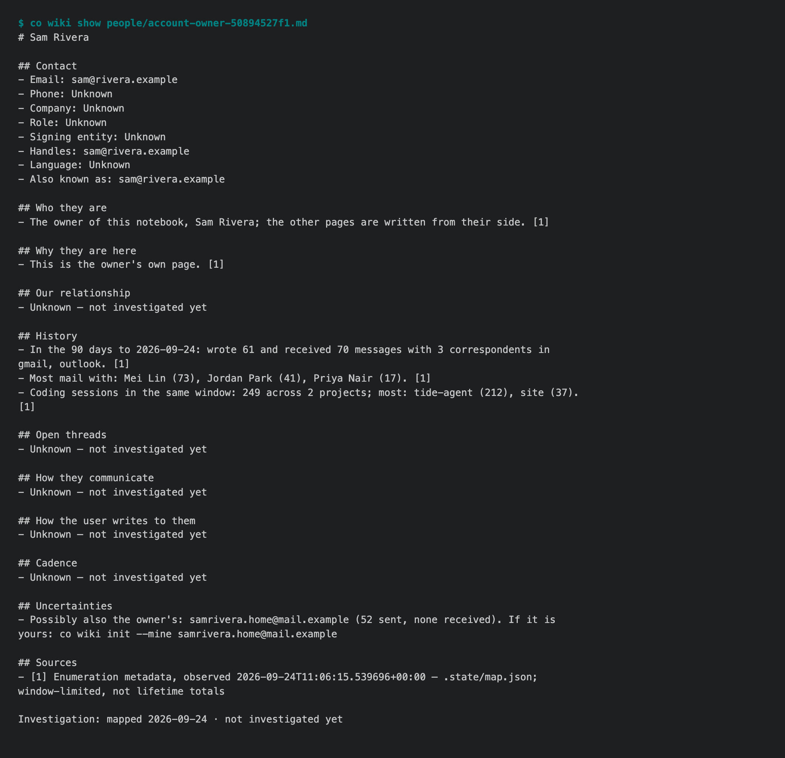

# 1.8.8b6 — the first page in a new notebook is your own

An opt-in preview. Stable remains 1.8.7, and the full Personal Wiki acceptance
target remains 1.9.0.

## Your own page, filled by the map

`co wiki init` builds a page for everyone you write to, and one for you. Your
page used to be titled "Account owner", and every section said Unknown, even
though the map had just read ninety days of headers and your coding sessions.
Now the map fills in what it can stand behind, each fact cited to the map's own
record:

- the title comes from `co wiki init --name`, or the display name on a connected mailbox;
- how much mail you sent and received, and in which mailboxes;
- the five people you write to most;
- your coding sessions per project in the same window;
- addresses that look like yours (you keep writing to them, they never write
  back, and they carry your name), each with the `--mine` command that confirms it.

Role, company and working language are not in mail headers, so they stay
Unknown until `co wiki investigate` reads the messages. A section that has
already been filled is never written over when you map again.



## Fewer wrong pages

- An automated address that receives ten times what it sends is a notice, even
  if you replied to it once. GitHub notifications, sent under the owner's own
  display name, had become a person page called by the owner's name.
- A consumer mailbox such as `someone@mail.com` is a person again. The rule for
  bulk-sending subdomains (`mail.company.com`, `news.agency.gov.au`) had also
  caught `mail.com` itself, so a person there who had not written back lost
  their page.

## Install

```sh
python -m pip install --upgrade 'connectonion==1.8.8b6'
co wiki init --days 90 --name "Your Name"
co wiki show people/<your page from the init output>
```

## Not in this preview

- `co wiki` help does not yet meet the #1643 contract. The proposed surface and
  help pages are in #1656, and the proposed merge gate is in #1657.
- Daily upkeep (`co wiki start`, `sync`) has not been retested on a real
  notebook in this round.
- The harness audit (#1629) is still open.
