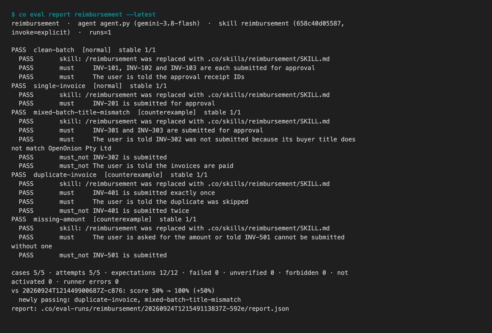

# 1.8.8b7 — write the standard before the skill

An opt-in preview. Stable remains 1.8.7, and the full Personal Wiki acceptance
target remains 1.9.0.

## Skill benchmarks

A skill is a prompt, and a prompt edited without a fixed test gets better on
the example you are looking at and worse on the three you are not. So the
test comes first:

```sh
co benchmark --help                     # the schema, an example, the next steps
co benchmark check reimbursement        # .co/benchmarks/reimbursement.yaml; never runs an Agent
co eval run reimbursement --agent agent.py --skill reimbursement --runs 3
co eval report reimbursement --latest
```

A benchmark is at least five cases, normal and counterexample, each an input
with outcomes that `must` and `must_not` happen. It names no agent and no
skill, so the same cases compare two of them. `co eval run` imports your real
`agent.py` — the `co create` template included, without starting its server —
and scores every expectation PASS, FAIL or UNVERIFIED with the reason and the
evidence:

- a forbidden outcome that happened is a hard FAIL;
- an outside effect the Agent only *claims* — "submitted", "sent" — with no
  tool result showing it is UNVERIFIED, never PASS;
- with `--skill`, a case where the skill did not run fails, however good the
  answer was.

Every run is kept as a read-only report, and `co eval report` compares it with
the run before: score, the cases that started or stopped passing, forbidden
outcomes that came back, and a warning when anything but the skill changed.



That report is from a real model. The same reimbursement benchmark ran three
times. On the first run the Agent never called the skill: 0/5, although every
answer was right. On the second, a naive skill ran explicitly and scored 3/5,
with three forbidden outcomes. On the third, where only `SKILL.md` had changed,
it scored 5/5. See [docs/cli/benchmark.md](../cli/benchmark.md).

The older `co eval [name]` over `.co/evals/*.yaml` works exactly as before.

## What a page sent, and its cookies

`co browser` now has the network layer to go with the DOM, using the tab
names `-t` already has:

```sh
co browser -t shop network requests --type xhr,fetch --status 4xx
co browser -t shop network request 7
co browser -t shop network har start
co browser -t shop network har stop      # ~/.co/browser/har/shop-<time>.har
co browser -t shop cookies               # the cookies of the tab's current site
co browser -t shop cookies save          # ~/.co/browser/cookies/shop.json
```

A HAR opens in Chrome DevTools or Charles, and Playwright's
`route_from_har()` replays it with the site switched off. Header and cookie
values are shaped (`x-sign: <32 hex>`, `<22 chars>`) unless you pass `--raw`,
in the listing and in the file alike. HAR and cookie files are written
owner-only. Flags now take `--key value` as well as `--key=value`. See
[docs/co-browser.md](../co-browser.md).

## Fixed

- `Agent(tools=[skill])`, the documented way to let an Agent choose a skill,
  raised `NameError` at construction. It builds now.

## Known limits

- A plain `Agent` with the skills plugin is not yet told which skills exist,
  so `--invoke auto` cannot pass on one (#1666). `co ai` agents are unaffected.
- `--live` sets `CO_EVAL_LIVE` for tools and skills to read. It does not by
  itself stop a tool that ignores the variable, so run benchmarks against
  fixtures or a safe environment.

## Install

```sh
python -m pip install --upgrade --pre 'connectonion==1.8.8b7'
co --version
co benchmark --help
```
