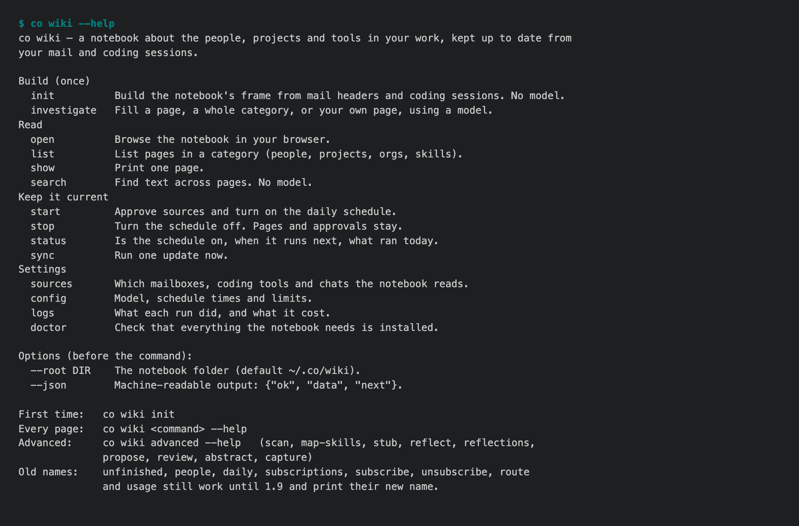

# 1.8.8b8 — co wiki, as agreed

An opt-in preview. Stable remains 1.8.7. The Personal Wiki becomes long-term
supported in 1.9.0, once it has its final name (#1664).

## The help pages are the design

`co wiki` had twenty-nine commands, and no help page had an example. The
surface was redesigned as its help pages first (#1656), reviewed, and then
built to match them. Each command now prints its page word for word, and a
test checks every page against the code: each command and flag a page shows
must exist, and each page links back to its parent.



- **Fourteen commands in four groups:** Build (`init`, `investigate`), Read
  (`open`, `list`, `show`, `search`), Keep it current (`start`, `stop`,
  `status`, `sync`), and Settings (`sources`, `config`, `logs`, `doctor`).
  Experimental commands are listed on `co wiki advanced --help`.
- **`investigate` takes a page, a category, or `me`.**
  - `investigate people --limit 3` fills up to three unfinished pages, most
    mail first. `--list` shows the order and runs nothing.
  - Your own page, addresses that may be yours, and automated senders are
    never picked.
  - `investigate me` fills your page from what you sent and your coding
    sessions of the last 30 days.
- **`sync` is the whole update:** new material, then at most one page. The
  schedule runs it.
- **Old names still work until 1.9:** `unfinished`, `people`, `daily`,
  `subscribe`, `subscriptions`, `unsubscribe`, `route` and `usage`. Each
  prints its new name.

## Upkeep that no longer stops for good

We ran every command against a real notebook (#1670). What it found is fixed
here:

- A maintenance batch that touched three pages was refused whole because one
  page lacked its diagram. The batch then never advanced, and every scheduled
  run retried the same refusal. Pages are now accepted one by one. A refused
  page keeps its old text, and its candidate is saved with the reason.
- The daily round always tried the person with the most mail first, and that
  person needed more model calls than the day allowed, so it failed every
  day. It now moves on to the next page.
- Investigations now appear in `co wiki logs` and `logs --usage` with their
  cost. They were missing entirely.
- `start` fails when its first update fails. Before, it returned success with
  the error buried in its output.
- A project page is read from its own sessions. Before, it read every mail
  that mentioned the project's name: 3,500 mails, then a timeout.

## Install

```sh
python -m pip install --upgrade 'connectonion==1.8.8b8'
co wiki --help
co wiki investigate
```

## Known limits

- `investigate me` is expensive. On a real notebook, 30 days came to 2.2
  million characters, 39 summary passes and about 75 minutes.
- One maintenance pass costs about 340k input tokens, however small the batch,
  because the model reads the notebook piece by piece (#1629).
- Organisation pages still read through the whole mailbox (about 20 minutes
  for 150 days).
- The product name is not final (#1664).
