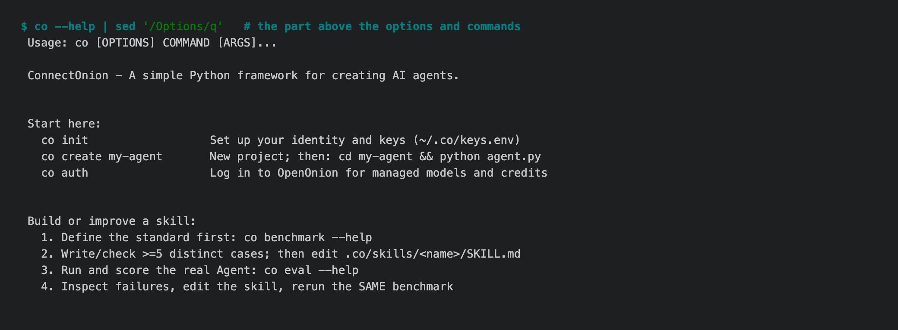

# 1.8.8b9 — what five testers found, fixed

An opt-in preview. Stable remains 1.8.7; the Personal Wiki becomes long-term
supported in 1.9.0.

Before deciding whether 1.8.8 could be stable, five testers installed 1.8.8b7
from PyPI into fresh profiles and used it the way a new user would: first run,
the browser, every inbox, hosting on two devices, and the experimental
commands. This preview is what they found, fixed. Every fix began as a test
that failed.



## Safety

- **A stale tap cannot approve the wrong thing.** With one session open on two
  devices, an "approve" left on the phone for a request the laptop had already
  answered was applied to the *next* request. Every approval and question
  answer now names the request it answers (`request_id`), and a stale one is
  refused (#1692). Until the web client sends the id, a session open on two
  devices refuses id-less answers rather than guess.
- **Headless Claude Code runs no longer load a cloned repo's settings,** hooks
  or MCP servers (`--setting-sources user --strict-mcp-config`), and turns
  started from a paired browser ask the owner again instead of running in
  Claude's `auto` mode (#1687).
- **Wiki runs are confined.** Scheduled and hand-started investigations ran
  Codex with `danger-full-access` and Claude with `bypassPermissions` while
  reading strangers' mail. They now run Codex with `workspace-write` and no
  network and Claude with `acceptEdits`, and the schedule runs the `co` that
  installed it (#1691).
- **A visitor sees only their own runs.** An agent's Home page showed the
  owner's recent prompts to any other identity that connected (#1702). A bare
  stranger is also refused by rule, without an LLM call on the owner's credits.

## Installing it

- **The preview install line no longer pulls in pre-release dependencies.**
  The `--pre` flag in the old install line also resolved httpx 1.0.dev6, which broke `connect()`,
  hosted agents and `co outlook`. httpx and pydantic are now capped below
  their next major, and the install line below has no `--pre` (#1696).
- **The wheel ships only user docs.** Internal test records with local paths
  are gone, and the wheel is 4 MB instead of 9.

## Things that did not work

- `co auth status` ran a full sign-in, and on a new machine created an account.
  *(Fix in review, #1693.)*
- `co create` then `python agent.py` said no one could onboard, because the
  project's `.env` — where `co create` wrote the invite code — was never read.
  `host()` reads it now, checks the port before printing its banner, and `GET /`
  answers (#1697).
- The browser daemon asked Chrome for its cookies after every command with no
  time limit; when Chrome stalled, every command leaked a connection until all
  of them failed, and `co browser status` hung. The check is bounded now, a
  selector that matches nothing exits 1, `--full-page true` no longer saves a
  file called `true`, and bad URLs are refused at once (#1704). The daemon has
  one address per user however they logged in, and an upgraded client still
  finds the old one (#1684).
- `connect().input(timeout=60)` hung for nine minutes on an approval. The
  timeout is a deadline now; approvals and questions reach the caller
  (`on_approval=`, `on_ask=`), `stop()` interrupts a turn, and a dropped
  connection is resumed (#1700).
- Inboxes: a WhatsApp send reported as failed could still go out later;
  Telegram group ids (which start with `-`) were read as options; `receive`
  waited forever on a listener that had already quit (#1698).
- The Wiki lost mail past 200 in a week, could pay twice for a batch it had
  written, and one stray `._` file stopped every command. `openpyxl` is now the
  `wiki` extra: `pip install 'connectonion[wiki]'` (#1690).
- `co --help` starts with how to begin; experimental commands say so on every
  surface, and edit/delete/react say where they are not implemented (#1688).

Also in this preview: `co schedule` can list, check, run now, pause and resume
(#1695, #1689).

## Still open

- The web client (`@connectonion/react`) must send `request_id` before two open
  devices can answer approvals; that release is prepared.
- `co whatsapp-cloud` waits on O API's messaging ingress.

## Install

```sh
python -m pip install --upgrade 'connectonion==1.8.8b9'
co --version
```
