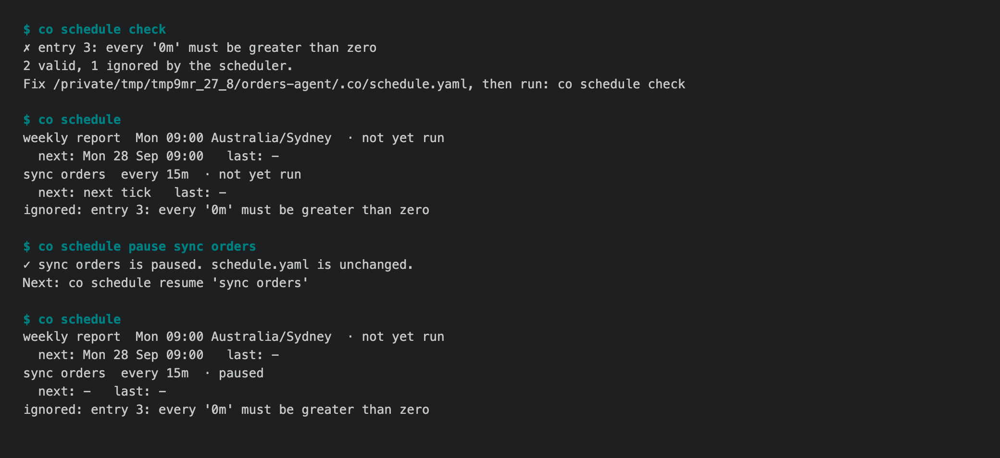

# 1.8.8b9 — a schedule you can see and control

An opt-in preview. Stable remains 1.8.7.

## `co schedule`

An agent runs the entries in `.co/schedule.yaml` on its own clock. Until now
the only way to see them was the Home page, and nothing could pause one or run
one now. `co schedule` does both (#1685):



- `co schedule` lists each entry with its next run, last run, status, the
  reason a run failed, and the session it produced. `--json` is for scripts.
- `co schedule check` reads the file exactly as the scheduler does and exits
  1 naming each entry it would ignore.
- `co schedule run|pause|resume <name>` write the scheduler's own state file,
  never `schedule.yaml`. The running agent acts on them within a minute, and a
  pause survives restarts and deploys. The Home page shows paused entries.
- The help follows the #1643 contract: every page says whether it changes
  anything, has an example, and names its way back.
- The file format is documented for the first time: `docs/cli/schedule.md`
  (#1680).

## One entry no longer stops the others

- Due entries used to run one after another while holding the tick lock, and
  a `run` entry has no time limit. So one slow entry delayed every other
  entry, and one hung agent turn stopped the whole schedule until a restart.
  Now each due entry is marked `running` in the state file and runs as its own
  task (#1681). If the agent stops mid-run, the next start records that run as
  failed with the reason.
- An agent that started with an empty schedule never started its clock, so an
  entry written later (for example by the agent itself, when asked to "do this
  every morning") never ran until a restart. The clock now always starts
  (#1682).
- `co deploy --to` sent a local `.co/schedule-state.json` over the server's,
  rewinding the server's record of what had run. It is now excluded. The same
  problem for `.co/session_results.jsonl` is tracked in #1694.

## Also in this preview

- **Wiki runs are confined (#1691).** Unattended investigation no longer runs
  Codex with full access or Claude Code with `bypassPermissions` while reading
  mail from strangers. Scheduled runs call the `co` that installed them.
- **Headless Claude Code no longer loads a cloned repo's settings (#1687).**
  Every `run_co_claude` launch is back to safe mode. Station browser turns ask
  the owner again, instead of following Claude's own `auto` mode.
- **One browser daemon per user (#1684)**, however they logged in. An upgraded
  client still finds and closes the old daemon, `close` ignores display flags,
  and `ps` is parsed in the C locale.
- **Experimental labels appear in every help surface (#1688).** On providers
  that cannot do it, `edit`, `delete` and `react` say they refuse.
- **The README leads with the agent CLI harness (#1636).**
- **First run tells the truth (#1697).** `host()` reads the project `.env`,
  so the invite code `co create` wrote now works. A taken port is caught
  before the banner prints, and seven other first-run messages were fixed.
- **The Personal Wiki keeps going (#1690).** A week with more than 200 mails
  loses none of them, a batch that was already written is not paid for twice,
  one stray file no longer breaks every command, and `openpyxl` moves into the
  `wiki` extra.

## Install

```sh
python -m pip install --upgrade --pre 'connectonion==1.8.8b9'
co schedule --help
```

## Known limits

- A hung `run` entry is isolated, not stopped. A worker thread cannot be
  killed safely, so the entry shows `running` until the turn ends or the agent
  restarts.
- `co schedule` finds the project from the current directory. On a server, run
  it in the agent's directory (`/srv/<agent>`).
- There are no Run now or Pause buttons in O Chat or Control Center yet
  (#1683).
