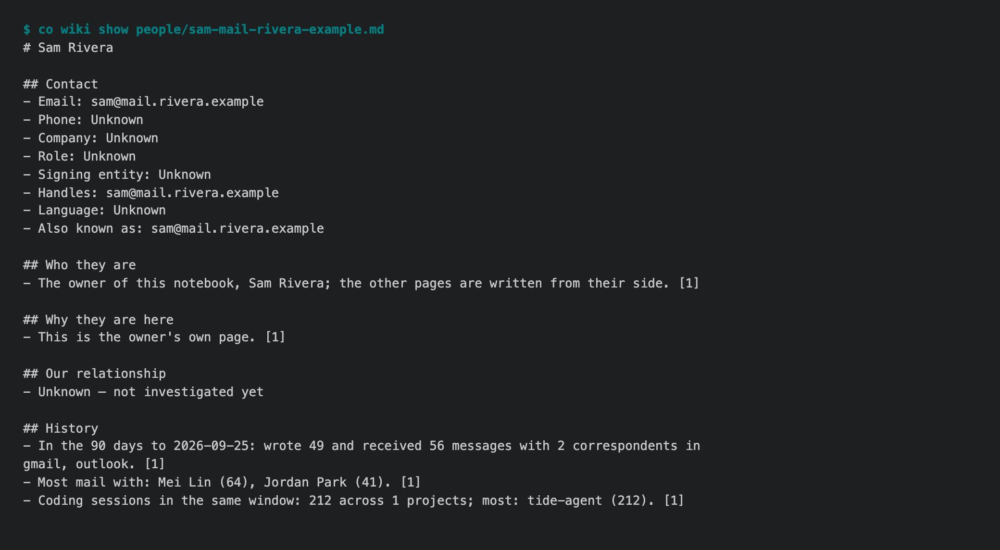

# 1.8.9b1 — the first preview of the fix line

An opt-in preview. Stable is 1.8.8.

1.8.9 is a fix line. It will ship many previews, each carrying the fixes that
have landed, toward one 1.8.9 stable that closes a large set of problems found
in real use. Everything planned for it is listed in
[#1722](https://github.com/openonion/connectonion/issues/1722).

## Upgrading a Wiki notebook keeps working

These came from upgrading a real notebook from 1.8.8b3:

- **Your page is rebuilt after an upgrade.** An older map, not yet knowing an
  address was yours, had made it an ordinary contact page with one mail. The
  new map recognised it as yours, reused that page, and left it as it was.
  A page nobody has investigated holds only what a map wrote, so the map now
  rewrites it: your name as the title, all your addresses, who you write to
  most, and where you work. A page someone has investigated is never touched.
- **One malformed suggestion no longer fails an update.** A nightly update can
  suggest a question for you to review. A suggestion that linked one page where
  it needed two failed the whole update after its pages were already written.
  The update did not advance, so the same material would have been reworked
  every night. A malformed suggestion is now dropped, with the reason saved in
  `.state/reviews-dropped.json`.

With both fixes, that notebook's first real update completed. It read 40
session messages, updated two pages, kept two refused pages as they were, and
moved on.



## Install

```sh
python -m pip install --upgrade --pre 'connectonion==1.8.9b1'
co wiki show me
```

## Known limits

- A notebook created before 1.8.8 still uses the model and limits it was
  created with, until you run `co wiki config set model gpt-6-luna` (#1714).
- The nightly round rarely investigates a page: the pages that matter most
  need more calls than one night allows (#1723).
