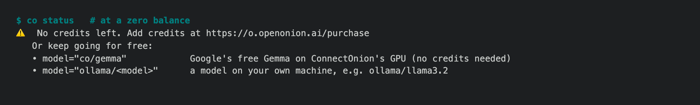

# 1.8.9b17 — Gemini 3.8 is the default again

An opt-in preview on the 1.8.9 fix line
([#1722](https://github.com/openonion/connectonion/issues/1722)). Stable is 1.8.8.

## The default model

1.8.9b10 made the free `co/llama` the default for every `Agent()`,
`llm_do()`, `co ai`, built-in sub-agent and project template that names no
model. `co/llama` is Llama 3.1 8B, with a 4,096-token context and one shared
GPU slot. By the owner's decision the default is `co/gemini-3.8-flash` again,
as it is in stable 1.8.8 (#1869).

An agent that names its model is unchanged. One that relied on the default
moves from Llama back to Gemini 3.8, and managed Gemini calls are billed to
your credits again.

## Free models are the zero-balance tip

`co/gemma` and `co/llama` stay free and selectable. When your balance reaches
zero, `co status` now names them beside the purchase page:

```text
⚠️  No credits left. Add credits at https://o.openonion.ai/purchase
   Or keep going for free:
   • model="co/gemma"            Google's free Gemma on ConnectOnion's GPU (no credits needed)
   • model="ollama/<model>"      a model on your own machine, e.g. ollama/llama3.2
```



A test now fails the build if any current doc calls `co/llama` the default.

## Fixed

- **A background listener loaded whatever `connectonion/` sat in the directory
  it was started from.** In b16's own end-to-end run, `co whatsapp listen
  --restart` from inside a checkout started a listener on the checkout's code,
  and b16's new self-restart could have re-entered it every minute. The
  listener now starts in its inbox directory, and restarts at most once per
  installed version (#1878).

## Install

```sh
python -m pip install --upgrade 'connectonion==1.8.9b17'
co --version
```
