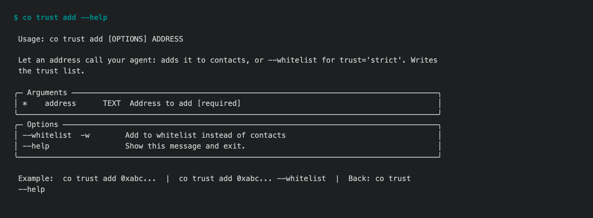

# 1.8.9b2 — every help page says what the command does

An opt-in preview on the 1.8.9 fix line (#1722). Stable is 1.8.8.

## Help an agent can act on

For an agent, a `co` help page is the prompt that describes the tool. We
audited all 300 commands (#1721). Each one opened its help without error and
none wrote a file doing it. But only 14 had what #1643 asks of every page: an
example, what the command changes, and the way back to its parent.



- **Every command outside `co wiki` (264 of them) now has an example** whose
  flags exist, and a first line that says what it changes: Read-only,
  Sends, Deletes, Charges and so on. Each of those statements was written from
  the command's code, not guessed from its name.
- **Every page ends with the way back** (`Back: co trust --help`). It is
  generated from the command tree, so commands added later get it as well.
- **CI enforces it (#1657).** `tests/unit/test_cli_help_contract.py` checks
  every page offline, with no exceptions. A new command fails CI until its
  help meets the contract.
- **Discovery fixes.** A model that saw only the help pages it asked for
  found the right command for 9 of 14 goals. After these fixes it finds 13 of
  13 single-step goals:
  - `co status` says it shows your **credit balance**.
  - `co trust` says its lists decide **who may call your agent**.
  - `co env set` says it writes the `~/.co/keys.env` that **every project
    reads**.
  - `co skills` and `co sub` say which one is for someone else's published
    skills.

## Help that was wrong, now corrected

- `co auth feishu` and `co auth lark` **create a Feishu application you own**.
  The page now says so.
- `co keys --ssh --write` writes to `~/.co/ssh/`, not `~/.ssh/` as its option
  help said.

## Install

```sh
python -m pip install --upgrade 'connectonion==1.8.9b2'
co --help
```

## Known limits

- `co wiki` keeps its own reviewed help pages (#1656). 27 of its 36 pages
  still lack an example or a statement of what they change. They are being
  rewritten in #1667.
- The discovery test is opt-in (`pytest -m real_api
  tests/e2e/real_api/test_cli_discovery_journeys.py`). Two multi-step goals,
  writing a new skill and adding a published skill to a project, are expected
  failures: the test accepts a single command.
