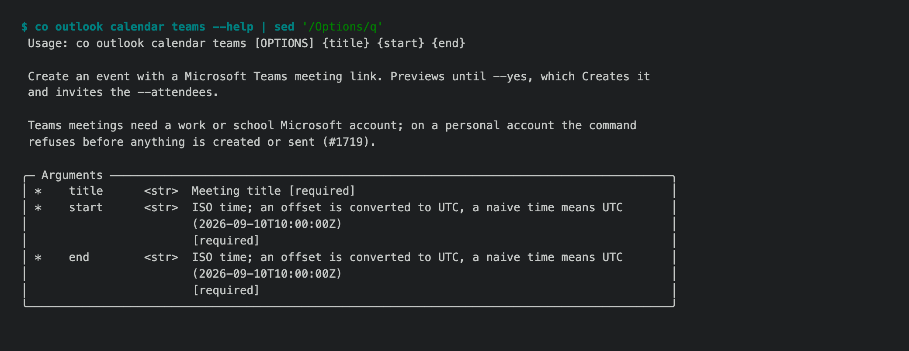

# 1.8.9b3 — tools that tell the truth about what they did

An opt-in preview on the 1.8.9 fix line (#1722). Stable is 1.8.8.

Six bugs reported in real use, each fixed from a test that failed first. What
they share is a tool that reported success, or blamed the wrong party, when
something else had happened.



## Fixed

- **A write reports success only once the bytes are on disk (#1338).** An
  unattended agent saw ✓ on three writes that never changed the file. The
  cause in 1.7.0 was fixed in 1.8.0, but the success message was still built
  from the arguments, and an approval that was rejected, timed out or ran in
  plan mode still read as success. `write` and `DiffWriter` now read the file
  back and compare bytes; anything else is a failure that says "Not written",
  and the run log shows the full reason.
- **`co outlook calendar teams` refuses on a personal Microsoft account before
  creating anything (#1719).** Graph ignored the Teams request, created the
  event anyway and Outlook mailed the invitations — with no link. Teams
  meetings need a work or school account; the command now checks first and
  sends nothing.
- **A rejected API key says whose it is (#1728).** A bad OpenOnion key was
  reported as a service-side problem to retry later. Checked live against
  O API: it now says "Your OpenOnion API key was rejected (Invalid token). Run
  `co auth`…", and keeps "service-side" for a provider that rejects O API's own
  key.
- **`co create --key` keeps the key it was given (#1341).** Once
  `~/.co/keys.env` had any content — always, after `co auth` — the typed key was
  dropped, so an OpenRouter key never reached `OPENROUTER_API_KEY`.
- **A plain Agent with the skills plugin is told which skills exist (#1666).**
  The code that lists them for the model was never called, so the agent could
  not choose a skill and `co eval run --invoke auto` could not pass. An Agent
  without the `skill` tool is not told about skills it could not load, and gets
  one warning naming `tools=[skill]`.
- **`co deploy` no longer sends a laptop's runtime state over the server's
  (#1694).** A local `.co/session_results.jsonl` replaced the server's session
  history; so could the replay store, remote-browser leases and profile,
  uploads and the contacts onboarded on the server. Six more paths are
  excluded, each pinned by a real-rsync test.
- **`co doctor` no longer crashes counting evals an agent is trimming (#1653).**

## Known limits

- `co deploy` still sends `whitelist.txt` and `blocklist.txt`, which the
  author writes; a laptop copy can undo a promotion or block made on the
  server. Which side owns them is a product decision.
- The skills list is now part of every prompt of an Agent with the skills
  plugin, which costs tokens on each request; not yet measured.

## Install

```sh
python -m pip install --upgrade 'connectonion==1.8.9b3'
co --version
```
