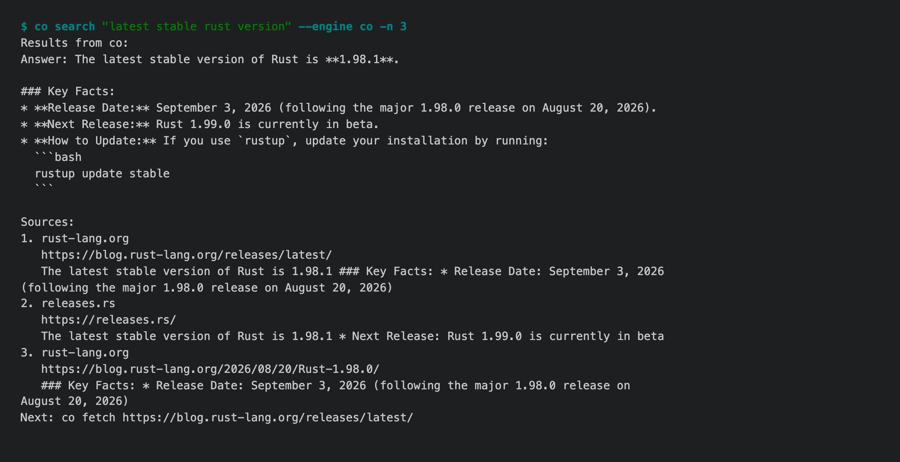

# 1.8.9b4 — co ai can search the web and read a page

An opt-in preview on the 1.8.9 fix line (#1722). Stable is 1.8.8.

## Search and fetch, by default (#1724)

Skills written for Claude Code or Codex say "search for" and "read the docs
page". `co ai` had no tool for either, so those skills stopped at their first
lookup, or drove `co browser` through a search page.



- **`web_search` and `web_fetch` are in `co ai`'s default tools**, and the
  approval policy treats them as reads. The same functions are commands:
  `co search` and `co fetch`.
- **Managed search needs only `co auth`.** The `co` engine asks Gemini with
  Google Search grounding on our backend and returns its short answer plus
  the pages it cites, redirect links resolved to real URLs. Each Google query
  costs $0.02 of credits (production, 2026-09-26: two searches, balance down
  exactly $0.04).
- **Out of credits, search keeps working.** `auto` answers from DuckDuckGo
  (free, no key) and says why. An explicit `--engine co` fails with one next
  step: `co search '<query>' --engine ddg`. Your own `SERPER_API_KEY` or
  `BRAVE_API_KEY` is used before credits when set.
- **`web_fetch` returns Markdown**, not HTML. It refuses hosts that resolve to
  loopback, private or link-local addresses on every redirect hop, reports a
  redirect to another site instead of following it, and points at
  `co browser` when a page needs JavaScript. `--prompt` has a small model
  answer from the page.

## Also in this preview

Everything in [1.8.9b3](1.8.9b3.md): six tools that reported success, or
blamed the wrong party, now tell the truth.

## Install

```sh
python -m pip install --upgrade 'connectonion==1.8.9b4'
co search "python json indent"
```

## Known limits

- Google's grounding terms ask apps to show its Search Suggestions; `co`
  search does not display them yet. Whether an agent tool must is open.
- DuckDuckGo's HTML endpoint limits scripted use; heavy use may get
  temporarily refused.
- The per-query price is preview pricing and may change before stable.
