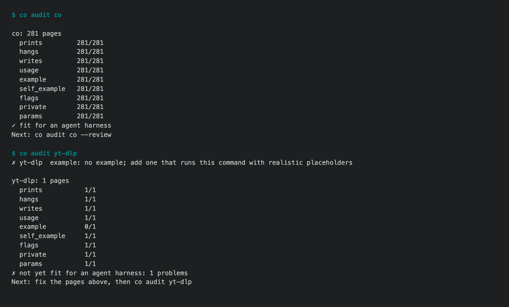

# 1.8.9b8 — co audit, and every co page passes it

An opt-in preview on the 1.8.9 fix line (#1722). Stable is 1.8.8.

## `co audit <command>`

For an agent, a command's help is the only description of the tool it has.
`co audit` asks whether a command-line tool, ours or anyone's, is fit for an
agent harness, and answers from what the tool prints (#1735):



```sh
co audit co              # all of co
co audit co gmail        # one group
co audit yt-dlp          # any program on PATH
co audit gh pr --review  # then a model judges each page that passed
```

- It never reads source code. It runs `<command> --help` (or `-h`) in an empty
  home and working directory with no input, opens every subcommand the page
  lists, and walks down.
- **Rules first.** A page must print and exit, not hang, not write files, and
  have a usage line and an example of this very command. The flags in the
  example must be documented, every option and argument must be described,
  and examples may hold no private paths or addresses. You get a score per
  rule and a verdict.
- **A model last** (`--review`), and only for pages that pass every rule. It
  judges what a rule cannot: is the page clear to a newcomer, does it say what
  the command changes, is the example realistic, is it simple. It returns one
  concrete rewrite.
- The same engine gates every PR here. A `help-gate` workflow reviews the
  pages a PR changed and reports without blocking.

## Every co help page passes it

We ran `co audit co --review` on all 281 pages and fixed what it found (#1748):

- 4 `co wiki` pages gained examples, and 113 options and arguments that had
  no description now have one.
- The model flagged 114 pages. Each suggestion was checked against the code,
  and the review is now down to 12 flags, 5 of them declined on purpose.
- Several pages were wrong, not only unclear, and are now accurate:
  - `co env rotate` writes the secrets store, not the env file.
  - `co trust remove` leaves blocks and admins in place.
  - A Drive row number in `co gmail draft attach` needs `--drive-listing`.

## Install

```sh
python -m pip install --upgrade 'connectonion==1.8.9b8'
co audit co
```

## Known limits

- `co audit` reads the common help layouts: Typer, `Commands:` sections, gh,
  argparse, and our wiki pages. A layout it does not know shows up as missing
  subcommands. It reads help at 200 columns; a tool that puts every option's
  description on the next line, whatever the width, would be reported as
  undocumented.
- The model review varies between runs, so it advises and never blocks.
- Found and not fixed here: `co syno` accepts `--refresh` on five status
  commands and ignores it (#1782). Unsupported inbox verbs ask for credentials
  before they say they are unsupported (#1783).
