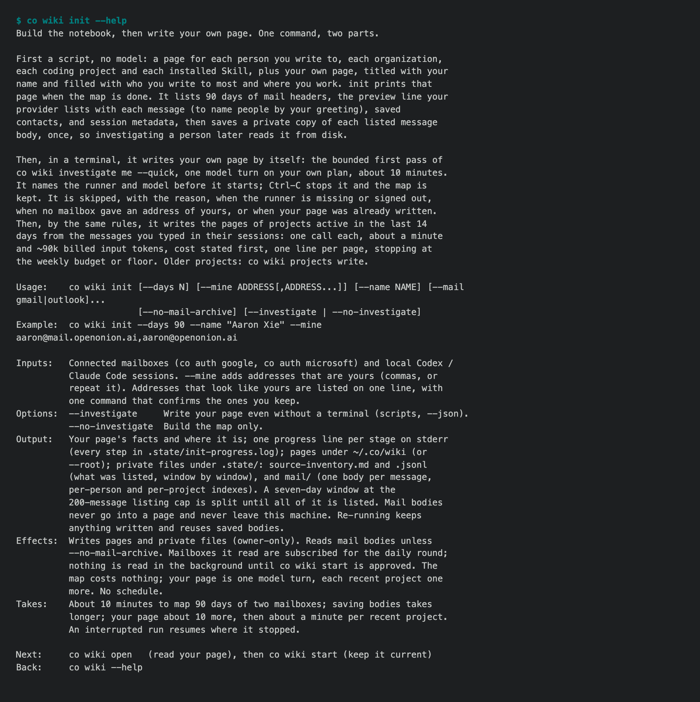
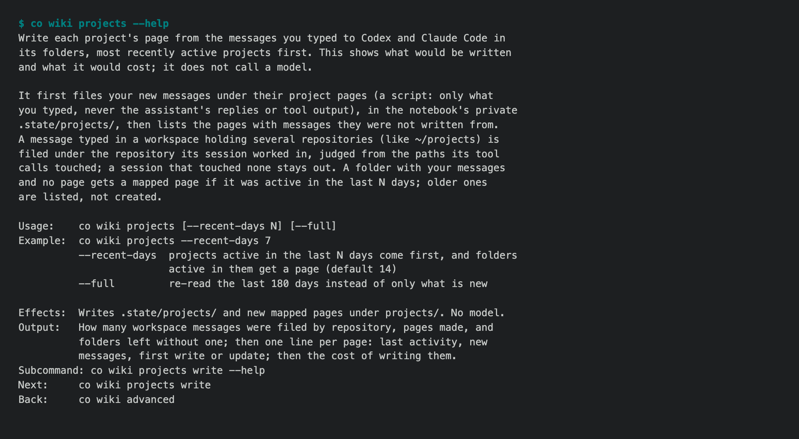

# 1.9.0a2 — a first run you can read

An opt-in preview of 1.9.0, where the personal notebook (being renamed co rem,
#1932) becomes long-term supported. Stable is 1.8.9. The design is the owner's,
written down in #1943.

## One command, and something to read in the first minutes

The owner's own first run, on 2026-09-25, took ten and a half minutes, wrote a
15,498-line log, made 532 empty pages, ended with twelve separate questions,
and left the next command to be discovered. Nothing on it was worth reading.

`co wiki init` is now one command in two parts:

- **A script, no model**, that maps your mail and your coding sessions. It
  checks first that the model runner (Codex by default) is installed and signed
  in, prints one line per stage instead of thousands, and prints your own page
  the moment the map is done: who you write to most and where you work.
- **Then, by itself, your page and your recent projects.** Your own page is
  written in one model turn on your own plan; then the pages of projects active
  in the last 14 days, one call each. It says what it will spend before it
  starts, Ctrl-C keeps the map, and `--no-investigate` skips it.

Addresses that look like yours are listed on one line with one command
(`co wiki init --mine a,b,c`). The mailboxes init read stay subscribed for the
daily round. Next is `co wiki open`, then `co wiki start`, everywhere.



## Project pages from what you told your coding agents

A project page is written from the messages you typed to Codex and Claude Code
in that project, never the assistant's replies or tool output (#1947). Sessions
you started in a workspace folder that holds many repositories are filed under
the repository they actually worked in, from the files and commands the session
touched: on the owner's machine 250 of 590 such messages found their repository
(#1948). A folder active in the last 14 days gets a page; an update reads only
what you typed since. `co wiki projects` shows the order and cost without
spending; `co wiki projects write` writes.



## People, recent first, from new mail only

`co wiki investigate people` works through the people you wrote to in the last
14 days first, a portion at a time, and says how many are left. Someone already
investigated is updated from mail since then. On the person the #1850 baseline
was measured on, a full investigation that took 31 calls, 8.2M input tokens and
3 h 24 min now takes one call, 1.93M input tokens (most of it cached) and 15
minutes, including fetching 265 mails (#1951, on 1.9.0a1's evidence search).

## A daily round that finishes and follows

The first scheduled run of the day finishes unfinished pages, most recent
activity first. Every later run looks only at what is new since the run before
— people who wrote, projects with new messages — and a run with nothing new
spends nothing (#1723).

## Install

```sh
python -m pip install --upgrade 'connectonion==1.9.0a2'
co --version
```

## Known limits

- The first run's timings on a real mailbox (your page ~10 minutes, ~1 minute
  and ~90k billed input tokens per recent project) are from single measured
  runs, not yet from new users.
- 340 of 590 workspace messages still reach no project: most are Codex Desktop
  threads that record no tool calls, so nothing shows where the work happened.
- The command is still `co wiki`; `co rem` arrives with #1932.
- The schedule runs on macOS only; elsewhere, run `co wiki sync`.
