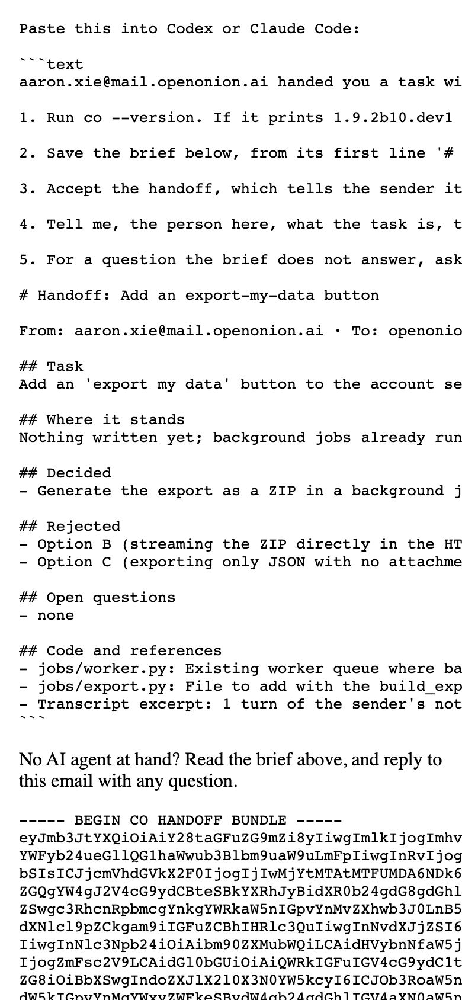
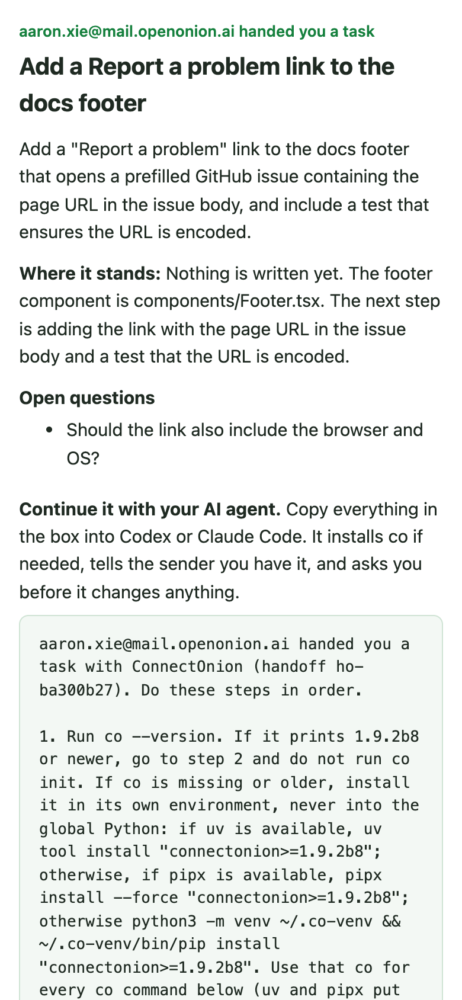

# ConnectOnion 1.9.2b10 (beta)

## Install this preview

Stable remains 1.9.1. Install this opt-in beta by exact pin:

```bash
python -m pip install --upgrade 'connectonion==1.9.2b10'
```

## A handoff mail you can read on a phone




The `co handoff` mail now reads like a mail. It opens with who handed you
what, then the task, where it stands and the open questions, as paragraphs.
One sentence says what to do next, and below it is the block for Codex or
Claude Code, in a box that wraps on any screen. The machine-readable bundle
that `co handoff open` reads is still there, in small grey type at the end.

Before, the whole mail was one unwrapped block. At a 390 px phone width the
page measured 4,494 px across, the prompt's Markdown fences showed, and the
task sat under the install step.

- **An install floor that exists.** The paste-in block used to ask for
  `connectonion>=` the sender's own version. A sender on a development build
  (`1.9.2b10.dev1`) therefore asked for a version no index had. The floor is
  now fixed at 1.9.2b8, the oldest release that accepts a handoff from the
  prompt.
- **co installs in its own environment** (#2396): uv, then pipx, then a
  venv at `~/.co-venv`, never the recipient's global Python.
- **`co email send` keeps paragraphs** (#2395): a plain-text body arrives with
  its line breaks instead of as one paragraph.

## Also in this preview

- **One line installs co** (#2403):
  `curl -fsSL https://raw.githubusercontent.com/openonion/connectonion/main/install.sh | sh`
  installs co in its own uv environment and sets it up: identity, starter
  credit, and Codex and Claude Code learn about co. `co init` now prints one
  line per coding agent instead of a 40-row skills table.
- **A handoff makes contacts** (#2399): once a handoff is accepted, each side
  is the other's agent contact (`co trust list`) and can hand work back by
  name. The code in the prompt is still not an invite code. Finer per-contact
  policies are coming (#2401).

## Tested across two machines

A handoff went from one Mac to Parrot, a second machine whose co was 1.9.2b5.
The text inside the box, exactly what a person copies, was given to Codex on
Parrot:

| Step | Result |
|---|---|
| `co --version` | 1.9.2b5, older than the floor |
| `uv tool install "connectonion>=1.9.2b8"` | 1.9.2b5 → 1.9.2b8 |
| `co handoff accept … --brief HANDOFF.md` | accepted; a first try hit a transient mail-service error, and Codex retried the printed command |
| Codex then | stopped to ask the person before changing files |
| Sender's `co handoff status ho-ba300b27` | "Accepted by 0xadfeca14cb… at 2026-10-11T01:00:28" |

## Verification and limits

- New tests, red on 1.9.2b9: the install floor never names a dev build, and
  the task is read before the agent steps, with no Markdown fences in the
  mail. The handoff suites pass.
- The box is shown with inline styles only. Mail clients that strip styles
  show it as plain preformatted text, still in reading order.
- The two-machine test is one run, with Codex. Claude Code reads the same
  text, but it was not run in this test.
