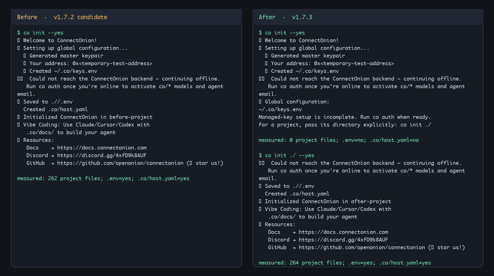

# ConnectOnion 1.7.3

Global credentials are the default; project initialization is explicit.

```bash
co init --yes                     # Global ~/.co/keys.env only
co init ./ --yes                  # This project's config, .env, and docs
co init ./ --template co-ai --yes  # Also add the hosted agent template
```

Scripts using init to scaffold a project must add `./` (or another existing
directory). Project-only options without a path fail before writing files.
`co create` is unchanged. Existing global provider keys are preserved; `--key`
explicitly saves a provider credential, while implicitly loaded process or
project keys are not copied into global storage.

Global setup remains usable offline and can recreate a missing `keys.env`
without changing the existing signing identity. Managed authentication still
requires a successful backend response; use `co auth` to finish it later.

Commands started within project subdirectories now resolve the same bounded
project `.env` as identity and auth. Explicit process variables win, then
project `.env`, then global `~/.co/keys.env`.

This release also carries the canonical `oo` useful skill, subscription-hint
correction, and pypdf lockfile security update prepared for 1.7.2. The 1.7.2
candidate was cancelled before publication; its tag was not moved.

Both product fixes and their tests/docs are already merged into main and present
in the public [1.8.0b1 preview](https://github.com/openonion/connectonion/releases/tag/v1.8.0b1),
through [#1382](https://github.com/openonion/connectonion/pull/1382) and
[#1385](https://github.com/openonion/connectonion/pull/1385). No 1.7 version
metadata is copied into 1.8. Release ledger: [#1390](https://github.com/openonion/connectonion/issues/1390).

## Captured CLI behavior

The image below renders actual stdout and measured filesystem state from
offline runs with disposable homes. Temporary paths and identity addresses are
redacted; no live credentials or backend requests are used.



Source tests: `test_init_defaults_to_global.py`, `test_project_env_loading.py`,
and the installed-wheel acceptance suite. The separate docs-site checkout is
not available locally; its deployed version metadata was not changed here.
