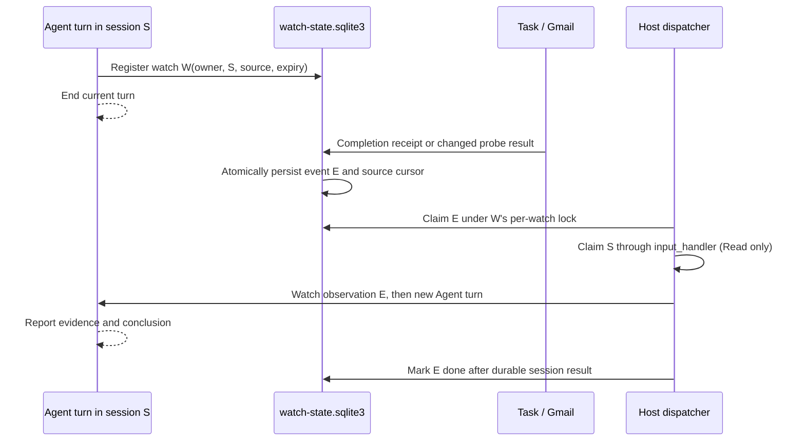

# Session-owned watches on the Host event runtime

Status: implementation draft for [#1788](https://github.com/openonion/connectonion/issues/1788), stacked on the Host event runtime in [#1781](https://github.com/openonion/connectonion/pull/1781). The Agent-owned feature targets 1.9.0. `co listen` is a separate inbound channel.

## The boundary

A watch has four steps: **register a source**, **observe without an LLM call**, **persist an event**, and **submit that event to the original session**. “Event driven” describes the last two steps: the Agent runs when a source reports a meaningful change. Observation remains source-specific. A task completion pushes a receipt immediately; a Gmail search runs at an interval and emits only when its result changes. File and timer watches declared in `host.yaml` already use the same Host event queue, but start in dedicated watch sessions.

## Durable records and ownership

The single Host database is `.co/watch-state.sqlite3`. The `events` table from #1781 is the only delivery queue. It gains `target_session_id` and `owner_address` columns, migrated when an existing 1.8.9 database opens. The source tables are `watches` (registration, probe config, cursor, next check, expiry, state) and `tasks` (session, owner, Host PID, terminal status, bounded output). These tables do not contain another event queue.

An Agent-created watch binds its verified session ID and owner address when registered. The internal queue name is `session-watch:<watch_id>` so it cannot collide with a Host-declared watch name. An event carries its stable ID, queue name, source, observed time, payload, target session, and owner. `target_session_id` and `owner_address` are authoritative columns, never read from the source payload. A Host-declared watch has neither target column and continues to use its stable dedicated session.

Only the authenticated Host owner can call `watch_task`, `watch_every`, `list_watches`, and `cancel_watch`. A task ID must belong to that same owner and session. One-shot CLI runs have no Host watch store and refuse persistent watches. A session may have at most ten active watches; interval checks run no more often than once a minute; watches expire within seven days. Creating a watch extends that session's retention through its expiry.

## Source adapters

### Managed background task

`run_background()` registers a durable task receipt before launching its process. The reader thread records `completed`, `failed`, or `cancelled` with bounded output. In the same SQLite transaction, every active watch for the task emits one event and becomes complete. Registration checks an existing receipt under a write lock: a task that finished between `run_background()` and `watch_task()` still emits once. At Host startup, running receipts owned by a dead Host PID become `unknown`; the event says that the exit status was not recorded. A missing process is never labelled successful.

### Recurring Gmail search

`watch_every(minutes=30, probe="gmail_search", query="...")` reads one baseline and stores matching message IDs as its cursor. At `next_at`, a Host probe claims the check, queries a bounded result set, compares IDs, and atomically commits the new cursor and any resulting event. No new IDs means no Agent turn. A crash after claiming a check but before committing its cursor retries after the claim timeout; the old cursor is still present, so new mail is not lost. An oversized result set or source error pauses the watch and emits an error event; the owner can cancel and recreate it after fixing the source. Arbitrary unattended shell commands or Agent tools are not accepted as recurring probes.

The recurring probe runs in a separate Host task from the event dispatcher. A slow Gmail request does not stop file/timer observation or queued event delivery. Task completion emits directly and does not wait for the probe loop.

## Delivery and conversation semantics

The dispatcher uses #1781's per-watch OS lock and `events` status claim. Different watch names may be processed concurrently. Before starting a turn it resolves the target session from the event row, verifies that the durable session still belongs to the recorded owner, and checks whether it is busy. A busy session leaves the event pending without consuming a failure attempt. Two watches targeting one session race through the existing atomic `claim_host_prompt`; one wins, the other remains queued.

`input_handler` is the only way to wake the Agent. Its claim persists the new turn in **Read only** mode before constructing or calling the Agent, so an old Full Access grant cannot be inherited even if the model fails. The event enters the model as framed, untrusted source data. Session history records `watch_event_id` in trace and source metadata on the user-role model message. Session Sync renders a `Watch observation` card instead of a human-authored bubble. The Agent's later assistant message is a distinct conclusion. After a successful watch turn, the session returns to Read only if it was already Read only; otherwise it returns to Auto. A failed turn remains Read only.

The #1781 runtime can also add newly queued events from the *same watch* at `before_iteration`, or request another iteration after a final model answer. Those events use internal reminders with structured event IDs and visible observation cards. A normal user turn is not interrupted: an event arriving while it is active waits for the next turn. Live injection is bounded to four batches of sixteen events; the rest stay queued.

## Crash and concurrency outcomes

| Stop point | Durable state | Recovery |
| --- | --- | --- |
| Source changes before event transaction commits | Old cursor/receipt | Reobserve and emit after restart |
| Event committed, no turn claimed | Pending event | Dispatcher claims it |
| Turn claimed, Host dies before session result | Running event; session may be interrupted | Release interrupted claim and retry, up to three failed attempts |
| Session result saved, event acknowledgement lost | Trace contains structured event ID | Mark event done without another Agent turn |
| User session busy | Pending event; no attempt spent | Deliver after that turn |
| Watch cancelled while event pending | Event marked cancelled | No new wake-up; a turn already running may finish |

This is at-least-once delivery across uncertain crashes. No queue can guarantee exactly-once external tool effects after a process dies between an effect and its recorded result. The Read only wake-up prevents unattended effects that require approval. Failed events remain inspectable and can be retried through the Host event runtime.

## Verification gates

1. Real managed process writes one receipt and one event; failure, cancellation, registration-after-finish, and restart-unknown are distinct.
2. A controlled clock proves a 30-minute no-change check uses no model turn, while a new ID emits one event; reopening the database retains the cursor.
3. A real `Agent.input()` through `process_one()` resumes the original session, records a structured event ID, renders a watch card, and leaves mode at Auto/Read only as required.
4. Busy-session and two-watch races preserve order without concurrent writes or wasted retry attempts. A saved-turn/failed-ack test does not rerun the model.
5. Opening a 1.8.9 event database migrates target columns without losing queued events. An installed Host and authenticated Gmail account exercise the provider path before release.
